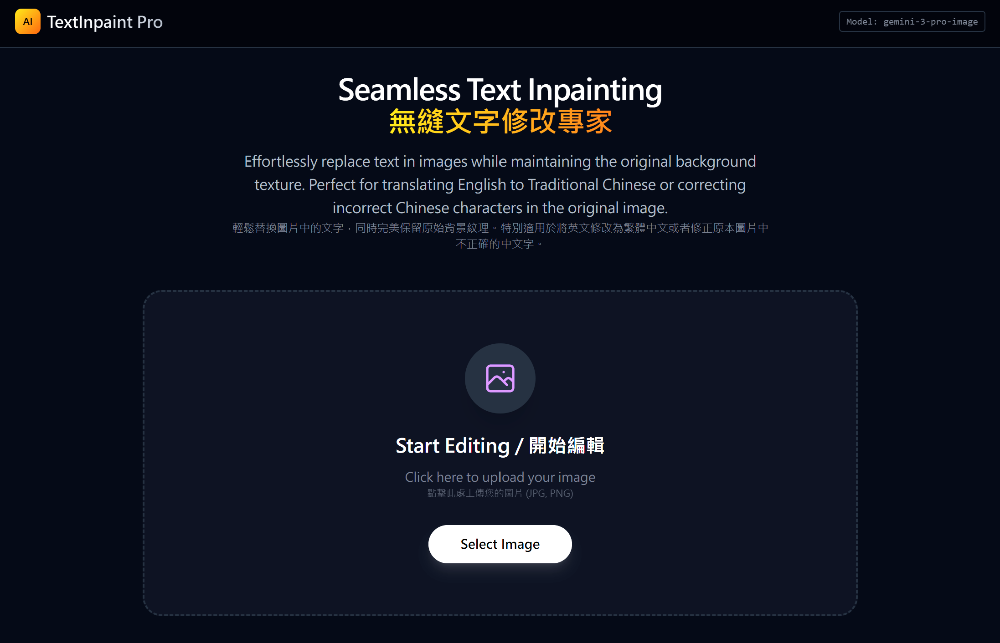
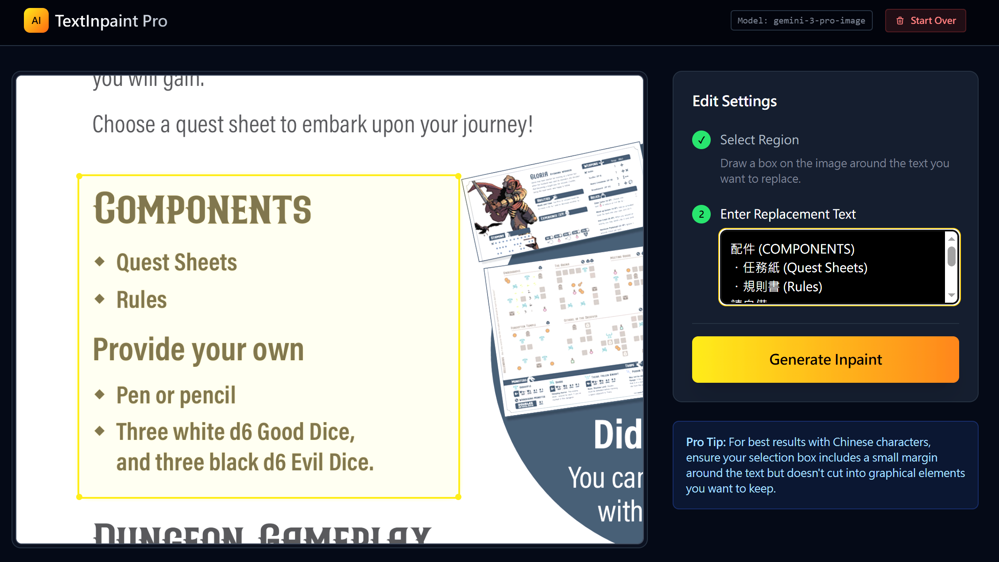
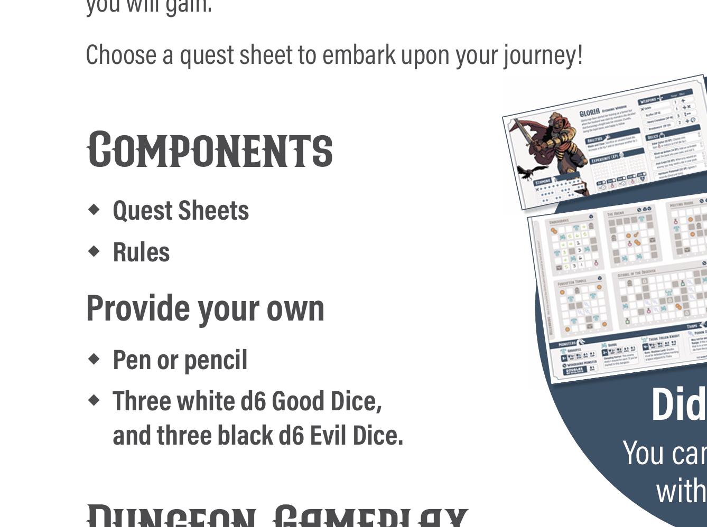
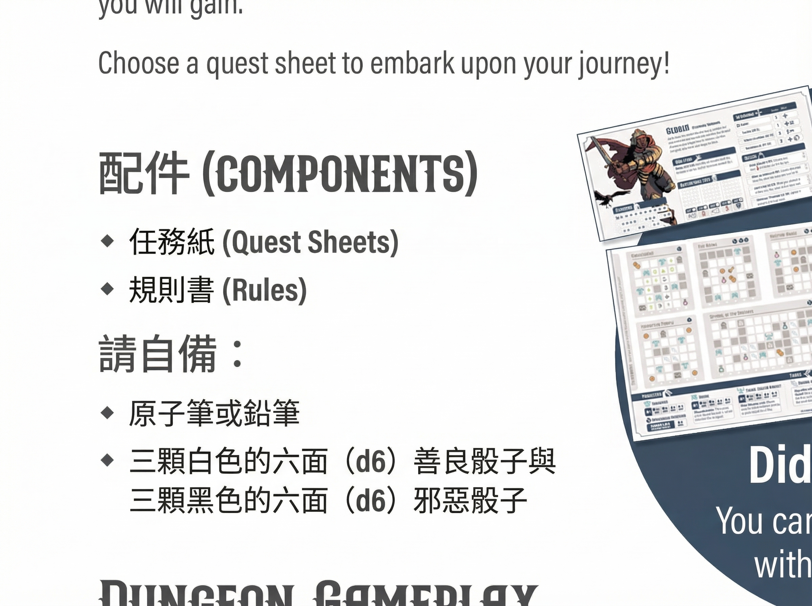

# Run and deploy your AI Studio app

This contains everything you need to run your app locally.

View your app in AI Studio.

## Run Locally

**Prerequisites:** Node.js

1. Install dependencies:
   `npm install`
2. Set the `GEMINI_API_KEY` in [.env.local](.env.local) to your Gemini API key
3. Run the app:
   `npm run dev`

## App screenshots

  <figure style="margin:0">
    
    <figcaption style="text-align:center;font-size:0.9rem">
      Page 1 — App homepage / 本應用首頁
      
Landing screen where users start editing by uploading an image. 上傳圖片開始編輯的首頁畫面。

    </figcaption>
  </figure>
  <figure style="margin:0">
    
    <figcaption style="text-align:center;font-size:0.9rem">
      Page 2 — Editor after upload: select region and enter replacement text / 上傳後編輯畫面：選取欲替換區域並輸入替換文字
      
Screenshot showing selection box and the replacement-text input before generating the inpainted image. 顯示選取框與輸入替換文字的編輯畫面。

    </figcaption>
  </figure>

## Text edit demo (文字替換示意)

The following demonstrates a feature of this project: select a text region in an image and replace it with specified text (left: original, right: edited).

以下示範本專案的功能：在圖檔中選取文字區塊並將其替換為指定文字（左圖為原始，右圖為替換後）。

  <figure style="margin:0">
    
    <figcaption style="text-align:center;font-size:0.9rem">Before — 原始圖片</figcaption>
  </figure>
  <figure style="margin:0">
    
    <figcaption style="text-align:center;font-size:0.9rem">After — 編修後（已替換文字）</figcaption>
  </figure>

